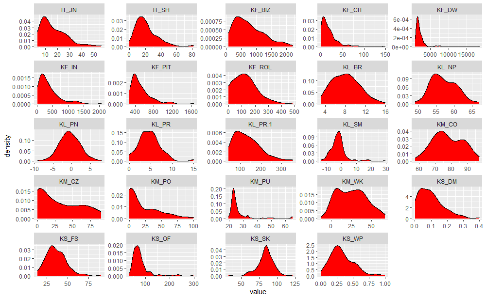

# Badanie rozwoju społeczno-gospodarczego {#Rozwoj}
## Rozwój społeczno gospodarczy {#badane}

Rozwój społeczno-gospodarczy to wieloaspektowe i złożone zjawisko, które nie jest łatwe do zdefiniowania.
Wzrost gospodarczy jest często utożsamiany z rozwojem, zwłaszcza w literaturze anglosaskiej, gdzie pojęcie *growth* i *development* jest stosowane zamiennie i odnosi się do wzrostu wskaźników makroekonomicznych (@borys). 
Zazwyczaj jednak w literaturze przedmiotu rozdziela się te dwa pojęcia z powodów, które trafnie ujął Z. Hull (@hull):

>„…to, co stanowi o treści rozwoju i określa charakter i formy jego realizacji pojmowane jest odmiennie: jedni sprowadzają go do przyrostu ilości materialnych dóbr i usług, wzrostu poziomu konsumpcji, ułatwień codziennego życia, zwiększania sfery wolności w życiu społecznym itp., natomiast inni kładą nacisk na kształtowanie nowych jakości życia, wypracowywanie nowych form i struktur życia społecznego, nowych form współbycia i współżycia w&nbsp;przyrodzie…”

Dlatego też przyjęło się, że wzrost oznacza ilościowe zwiększenie produkcji dóbr i&nbsp;usług w danej ustalonej przestrzeni i czasie.
Natomiast rozwój jest pojęciem szerszym i&nbsp;oprócz zmian ilościowych obejmuje zmiany jakościowe.
Rozwój społeczno-gospodarczy zawiera w sobie zmiany strukturalne oraz wiążące się z nimi zmiany instytucji i stosunków ekonomicznych (@pajak).

Tak rozumiany rozwój wymaga odpowiednich, uszczegółowionych metod oraz narzędzi badawczych.
Nie ma jednak konsensusu wśród badaczy zajmujących się tym zagadnieniem i proponowane są różne mierniki, dzięki którym można badać rozwój społeczno-gospodarczy.
W badaniu przyjęto (za @opallo) ogólny podział mierników na dwa rodzaje:

* podstawowe, bazujące na wartościach bezwzględnych zjawiska i procesy ekonomiczne oraz społeczne (np. liczba ludności, dochód z podatku PIT w danej jednostce przestrzennej)
* relatywne, opisujące stosunek wartości bezwzględnych względem siebie w danej jednostce przestrzennej (np. dochody z podatku PIT na 1 mieszkańca ).

Zgodnie z tą klasyfikacją w badaniu korzystano z mierników relatywnych. Poszczególne mierniki wykorzystane w badaniu opisano w podrozdziale \@ref(dane).

Rozwój społeczno-gospodarczy istnieje w danej jednostce przestrzennej, w określonym regionie.
W niniejszej pracy, kierowano się podziałem terytorialno-administracyjnym zgodnie z podejściem A. Hettnera wyrażającym się w poglądzie, że (za @pajak):

>...Określone przez naturę regiony nie istnieją, ponieważ podział taki zawsze wynika z ustaleń człowieka, jego aktywności gospodarczej, a nie uwarunkowań geograficznych

Dlatego w badaniu kierowano się podziałem terytorialno-administracyjnym kraju.
Zgodnie z powyższym za podstawowy region badań rozwoju przyjęto gminę.
Natomiast obszar badania ograniczono do województwa Zachodniopomorskiego. 

Zdecydowano się na województwo Zachodniopomorskie, ponieważ zgodnie z istniejącymi opracowaniami jest to województwo o dużej dysproporcji rozwoju. 
Na poziomie gminnym rozwojem społeczno-gospodarczym w województwie Zachodniopomorskim zajmował się @czyzycki w pracy *Rozwój społeczno-gospodarczy gmin województwa Zachodniopomorskiego*.
Konkluzją z jego pracy jest teza o dużym wewnętrznym zróżnicowaniu gmin w województwie. 
Za przyczynę tego stanu rzeczy stwierdzono brak opracowania zrównoważonej strategii rozwoju gmin oraz problem niegospodarności terenów po państwowych gospodarstwach rolnych (tak zwanych PGRów) położonych zwłaszcza w centralnej części województwa.
Badanie te przeprowadzono ponad dekadę temu.
Bardziej aktualne opracowanie dotyczy zróżnicowania poziomu ekonomicznego powiatów w województwie Zachodniopomorskim jak podają @adamczyk.
W&nbsp;badaniu stwierdzono między innymi, że w latach 2004-2010 zwiększyła się skala rozwarstwienia ekonomicznego poziomu rozwoju gmin oraz że relatywnie lepszą sytuacją gospodarczą charakteryzują się powiaty w aglomeracji szczecińskiej.

Szersza jest literatura przedmiotu poziomu rozwoju społeczno-gospodarczego gmin na poziomie krajowym.
Zagadnienie to poruszano między innymi w pracach @perdal_zastosowanie oraz @churski_teoretyczny. 
Jednak badanie na poziomie krajowym a regionalnym- wojewódzkim może doprowadzić do innych wniosków z uwagi na inne odniesienie do wzorca rozwoju.
Niniejszą pracę różni od powyższych także modyfikacja zmiennych diagnostycznych.
Przedstawiono różne metody wyznaczania liczby skupień/grup za pomocą analizy skupień, zastosowano algorytmy klasyfikacji (lasy losowe, xgboost) oraz analizy wariancji za pomocą języka R.

## Opis danych {#dane}

```{r load srodowisko_magist2, include=FALSE}
load("~/MAGISTERKA/R_magist/srodowisko_magist_2.RData")
```

Dane statystyczne użyte do konstrukcji wskaźników pochodzą z Banku Danych Lokalnych Głównego Urzędu Statystycznego.
Dane te pobrano dla gmin w województwie zachodniopomorskim w latach 2016-2019.
Zostały wybrane tak, żeby powstałe na ich podstawie wskaźniki opisywały wybrane aspekty rozwoju społeczno-gospodarczego:

* kapitał ludzki (KL)
* kapitał społeczny (KS)
* kapitał materialny (KM)
* kapitał finansowy (KF)
* innowacje techniczne i organizacyjne (IT)


Dane wyrażone w liczbach absolutnych (bezwzględnych) z BDL GUS przekształcono na liczby względne poprzez uwzględnienie liczby ludności, powierzchni gminy lub wyrażenie danej zmiennej w % (np. Dochody z podatku PIT na **1 mieszkańca** [zł]).
W&nbsp;przypadku, gdy w Banku Danych Lokalnych była możliwość wyboru kwartału, w którym zarejestrowano daną zmienną to zawsze wybierano stan na IV kwartał - 31 grudnia.
Natomiast w przypadku, gdy dane dla gminy były podzielone na wieś i miasto to decydowano się na średnią z tych dwóch wartości.


Podstawą do wyboru zmiennych był artykuł Doktora Perdała "Zastosowanie analizy skupień i lasów losowych w klasyfikacji gmin w Polsce na skali poziomu rozwoju społeczno-gospodarczego" [@perdal_zastosowanie].
Dokonano modyfikacji kierując się dostępnością wszystkich zmiennych w badanym okresie, biorąc pod uwagę kryteria merytoryczne oraz dążąc do redundancji danych - w tym celu posłużono się macierzą korelacji (Rysunek \@ref(fig:rycina1)).

```{r rycina1, echo=FALSE, fig.cap= "Korelogram czynników diagnostycznych", out.width = '130%'}
library(kableExtra)

my_data = dplyr::select(Gus_2016, -1,-2)
my_data <- round(cor(my_data,method="spearman"),2)
col2 = colorRampPalette(c('red', 'white', 'blue'))  
my_plot <- corrplot::corrplot(my_data,type = 'lower', order = 'hclust', tl.col = 'black', 
         cl.ratio = 0.2, tl.srt = 45, col = col2(10))
```

Zdecydowano się na współczynnik skolaryzacji netto dla szkół podstawowych mając na uwadze ciągłość danych, ponieważ reforma edukacyjna z 2019 roku zlikwidowała gimnazja.
Dodano wskaźnik podmioty gospodarcze w sekcjach J-N (usługi, specjaliści, informatyka) na 1000 mieszkańców, w celu zwiększenia liczby wskaźników stanowiących o innowacyjności danej jednostki przestrzennej.
W ten sposób powstały 24 zmienne diagnostyczne, które wykorzystano przy konstrukcji syntetycznego wskaźnika poziomu rozwoju dla lat 2016-2019 (Tabela \@ref(tab:tabela1)).


```{r tabela1, echo=FALSE}
library(kableExtra)
df = sciagawka
x <- knitr::kable(df, 
             caption = "Zmienne diagnostyczne, wykorzystane do konstrukcji syntetycznego wskaźnika rozwoju",
             booktabs = TRUE)  %>% 
  kableExtra::column_spec(1, width = "2cm") %>% 
  kableExtra::column_spec(2, width = "11cm")
add_footnote(x, c("Zródło: Opracowanie własne"), notation = "symbol")


```


Dane obejmują lata 2016-2019, w tym czasie doszło do kilku ważnych zmian administracyjnych w województwie zachodniopomorskim, które miały wpływ podczas procesu przetwarzania danych.
W badanym okresie liczba gmin z 114 zmniejszyła się do 113.
Stało się tak, ponieważ w 2019 roku zlikwidowano gminę Ostrowice.
Przyczyną było bankructwo gminy- jest to pierwszy tego typu przypadek w Polsce. 
Teren gminy Ostrowice został włączony do dwóch sąsiednich gmin, Drawska Pomorskiego i gminy Złocieniec.[@ostrowice]
Z powodu problemów finansowych w gminie Ostrowice w latach 2017-2018 rada gminy nie istniała, a do zarządzania gminą został powołany przedstawiciel rządu.
Dlatego zdecydowano, że wskaźnik udziału przedstawicieli władz publicznych, wyższych urzędników, kierowników oraz specjalistów w ogóle radnych dla gminy Ostrowice w latach 2017-2018 będzie wynosił 0.
W badanym okresie gmina Mielno w 2017 przekształciła się z gminy wiejskiej na wiejsko-miejską, nie wpłynęło to jednak znacząco na proces badawczy.

## Konstrukcja syntetycznego miernika poziomu rozwoju społeczno-gospodarczego{#wskaznik}

Do konstrukcji syntetycznych wskaźników rozwoju konieczne było przekształcenie zmiennych tak by były porównywalne. Dokonując wyboru metody pozwalającej na ujednolicenie rzędu wielkości zmiennych oraz pozbycia się mian kierowano się wykresem gęstości zmiennych. Ustalono, że większość zmiennych diagnostycznych cechuje się asymetrią prawostronną rozkładu (Rysunek \@ref(fig:rycina2)).

```{r rycina2, echo=FALSE, fig.cap="Wykres estymatorów gęstości zmiennych diagnostycznych (2016)" }

```
Mając na uwadze to że większość zmiennych nie charakteryzowało się rozkładem normalnym, zdecydowano się na metodę unitaryzacji zerowanej (za @churski_teoretyczny). 
Metoda ta wymaga następującej formuły dla:

* stymulanty

$$ 
Z_{ij} = \frac{X_{ij}-\min_{i}X_{ij}}{\max_{i}X_{ij}-\min_{i}X_{ij}}
$$

* destymulanty 

$$ 
Z_{ij} = \frac{\max_{i}X_{ij}-X_{ij}}{\max_{i}X_{ij}-\min_{i}X_{ij}}
$$
Polega to na tym, że każda minimalna wartość danej zmiennej jest przekształcana na 0, maksymalna wartość jest przekształcana na 1, a każda inna wartość jest przekształcana na ułamek z zakresu od 0 do 1.
Dzięki zastosowaniu normalizacji zerowanej mamy pewność że wszystkie poddane normalizacji zmienne (także te ujemne) będą nieujemne i znajdowały się w tym samym przedziale (od 0 do 1).

Następnym krokiem jest konstrukcja syntetycznego wskaźnika rozwoju na bazie zunitaryzowanych wskaźników z wykorzystaniem metody wzorca rozwoju.
W metodzie tej transformowano miarę niepodobieństwa Braya-Curtisa na miarę podobieństwa do wzorca, gdzie jako wzorzec przyjęto hipotetyczną jednostkę przestrzenną, która przyjmowała wartość maksymalną dla wszystkich zmiennych diagnostycznych (za @perdal_zastosowanie)

$$ d_{kj}^{BC} = 1 - \frac{ \sum_{j=1}^{m} | Z_{ij} - Z_{kj}| } {\sum_{j=1}^{m} | Z_{ij} + Z_{kj}|  }$$
gdzie:
$Z_{ij}$ - zunitaryzowana wartość wskaźnika $j$ dla gminy $i$ 

$k$ - gmina "wzorzec"

$j\in\{1,2,\dots,m\}$ - numer wskaźnika 

Wskaźniki syntetyczne przyjmują wartość z przedziału [0,1], im większa wartość wskaźnika syntetycznego rozwoju tym wyższy poziom rozwoju społeczno-gospodarczego. Syntetyczny wskaźnik poziomu rozwoju obejmuje wszystkie 24 zmienne diagnostyczne (Patrz Tabela \@ref(tab:tabela1)). Wskaźniki syntetyczne wyróżnionych aspektów poziomu rozwoju społeczno-gospodarczego (tj. kapitał ludzki, materialny), obejmują określone w Tabeli \@ref(tab:tabela1) wskaźniki diagnostyczne.
