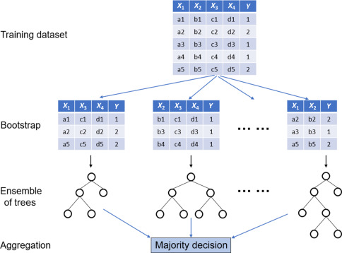

# Metody analizy danych {#metody}
## Analiza skupień - pojęcie, K-średnich, DBSCAN {#skupien}

Analiza skupień jest ważnym elementem statystycznej analizy danych.
Pojęcie to pierwszy raz użyto w 1939 roku przez Roberta Choate Tryona w pracy *cluster analysis* (za @najman).
Analiza skupień polega na grupowaniu danych w grupy zwane tez skupieniami, w zależności od tego jak ściśle są ze sobą powiązane.
Dąży się do tego żeby dane w jednym skupieniu charakteryzowały się wysokim poziomem podobieństwa, natomiast dane między skupieniami miały minimalny poziom podobieństwa.
Obecnie istnieje wiele metod i technik analizy skupień, w niniejszej pracy opisano metodę K-średnich oraz metodę DBSCAN.

Metoda K-średnich należy do jednych z najczęściej stosowanych algorytmów analizy skupień.
W grupowaniu K-średnich każde skupienie jest reprezentowane przez swój środek (tj. centroid), który odpowiada średniej z obserwacji przypisanych do skupienia.
Istnieje kilka wariantów algorytmu dla tej metody, do najbardziej znanych należą (za @k-srednich_book):

* Forgy/Lloyd
* MacQueen
* Hartigan-Wong

Standardowym oraz użytym w niniejszym badaniu algorytmem jest algorytm Hartigana-Wonga (1979), który definiuje całkowitą zmienność w obrębie skupienia jako sumę kwadratów odległości euklidesowych między elementami, a odpowiadającym im centroidem (za @k-srednich_internet).

$$ W(C_k) = \sum_{{X_i}\in C_k}(X_i - \mu_k)^2
$$
gdzie:
$X_i$ - obserwacja należąca do skupienia $C_k$

$\mu_k$ - średnia wartość obserwacji przypisanych do skupienia $C_k$ 

Każda obserwacja ($X_i$) zostaje przypisana do określonego skupienia w taki sposób, że suma kwadratów odległości obserwacji do przypisywanego im centroidu ($\mu_k$) jest minimalna.
Całkowita suma kwadratów w obrębie skupienia jest definiowana wzorem:
$$ \sum_{k=1}^K W(C_k) = \sum_{k=1}^K \sum_{{X_i}\in C_k}(X_i - \mu_k)^2
$$
Im mniejsza wartość całkowitej sumy kwadratów tym lepiej.

Pierwszym krokiem przy wykorzystaniu algorytmu K-średnich jest wskazanie liczby skupień ($k$), które zostaną wygenerowane w ostatecznym rozwiązaniu. 
Następnie algorytm losowo wybiera $k$ obserwacji ze zbioru danych, które mają służyć jako początkowe centroidy dla skupień.
Każda z pozostałych obserwacji jest przypisywana do najbliższego centroidu, gdzie najbliższy jest definiowany za pomocą odległości euklidesowej:
$$ d (x,y) = \sqrt{\sum_{i=1}^n(X_i - Y_i)^2}
$$
między obserwacją a średnią skupień (przypisanie obserwacji do skupień).
W kolejnym kroku algorytm oblicza średnią wartość dla każdego skupienia (koryguje centroidy).
Wszystkie obserwacje są ponownie przypisywane przy użyciu skorygowanych centroidów.
Następnie powtarza się przypisanie obserwacji do skupień i korygowanie centroidów do momentu, aż przypisania do skupień przestaną się zmieniać.
Oznacza to, że skupienia utworzone w bieżącej iteracji są takie same, jak te uzyskane w poprzedniej iteracji.

Pierwszym krokiem w powyższym algorytmie jest wskazanie przez analityka liczby klastrów/skupień. 
Przy wyborze optymalnej liczby klastrów oprócz wiedzy na temat charakteru danych warto kierować się jedną z metod służących do doboru liczby skupień.
W badaniu podczas wyboru optymalnej liczby skupień porównywano wyniki uzyskane trzema metodami:

* Metodą Łokcia (*Elbow Method*)
* Metodą Średniego Zarysu  (*Average Silhouette Method*)
* Statystyczną Metodą Luki (*Gap Statistic Method*)

Metoda Łokcia polega na obliczeniu dla każdego $k$ całkowitej sumy kwadratów wewnątrz klastra, a następnie przedstawienie na wykresie.
Można wyrazić ją wzorem:
$$ min(\sum^K_{k=1} W(C_k))
$$
Optymalna liczba klas występuje w miejscu zgięcia (kolana), czyli w gdzie $k$ i liczba klas $k>$ charakteryzuje się niską rozpiętością całkowitej sumy kwadratów wewnątrz skupienia.

Metoda Średniego Zarysu polega na wyliczeniu zarysu dla każdej obserwacji a&nbsp;następnie współczynnika zarysu na podstawie średniej wartości zarysu ($\overline{S}_k$). Zarys wyraża się wzorem:
$$ S_i = \frac{b_i - a_i}{max(a_i , b_i)}
$$
gdzie:
$a_i$ - średnia miara niepodobieństwa miedzy obserwacją a wszystkimi obserwacjami wewnątrz tego samego skupienia

$b_i$ - najmniejsza średnia odległość do najbliższego skupienia, do którego nie należy $a_i$

Współczynnik zarysu wyraża się wzorem:
$$ SC = max_k\overline{S}_k
$$
gdzie:
$\overline{S}_k$ - średnia wartość zarysu dla całego zbioru o k skupieniach

Statystyczną Metodą Luki została opracowana w 2001 roku przez R. Tibshirani, G. Walther, i T. Hastie (@gap). 
Wyraża się wzorem:
$$ Gap_n(k) = E^*_nlog(W_k)-log(W_k)
$$
gdzie:
$E^*_n$ - oznacza wartość oczekiwaną przy wielkości próby $n$ z rozkładu referencyjnego i jest zdefiniowane za pomocą metody bootstrap ($B$) poprzez wygenerowanie $B$ kopii referencyjnych zbiorów danych i przez obliczenie średniej

$W_k$ - macierz kowariancji wewnątrzgrupowych wtedy, gdy każda zmienna
oryginalna zastąpiona została zmienną wygenerowaną z rozkładu jednostajnego nad odcinkiem, który jest rozstępem próby zmiennej oryginalnej (za @korzeniewski)

Wybieramy liczbę skupień jako najmniejsze $k$ takie, że:
$$Gap(k)\ge Gap(k+1)-S_{k+1.}
$$

DBSCAN (ang. *Density-Based Spatial Clustering of Applications with Noise*) należy do algorytmów gęstościowych, czyli takich które biorą pod uwagę fakt, że skupienia są gęstymi grupami obserwacji. 
Uproszczając chodzi o to, że jeśli konkretna obserwacja należy do skupienia to powinna znajdować się w pobliżu wielu innych obserwacji w tym skupieniu.

Najpierw wybieramy dwa parametry, maksymalny promień sąsiedztwa epsilon ($\epsilon$) i liczbę minimalnej liczby obserwacji, dla których możemy powiedzieć że tworzy skupienie (*minPts).
Następnie zaczynamy od wybrania dowolnej obserwacji w naszym zbiorze danych.
Jeśli w odległości $\epsilon$ od tej obserwacji znajduje się więcej obserwacji niż wyznaczona minimalna liczba obserwacji dla skupienia, to uważamy obserwacje za część skupienia
Następnie rozszerzamy to skupienie, sprawdzając wszystkie nowe obserwacje i sprawdzając, czy one również mają więcej niż ustaloną minimalną liczbę obserwacji w odległości $\epsilon$.
Gdy nie ma obserwacji spełniających nasze warunki wewnątrz skupienia to wybieramy nową dowolną obserwacje i powtarzamy algorytm.
Obserwacje, które w odległości $\epsilon$ mają mniej niż minimalną liczbę obserwacji i nie są częścią żadnego skupienia uważamy za szum i nie przydzielamy do żadnego skupienia.
Sąsiedztwo $\epsilon$&nbsp;obserwacji $p$, oznaczone przez $N$ wyraża się wzorem (za @dbscan):
$$N_{Eps} (p)= \{{q\in D|dist(p,q) \le \epsilon}\}
$$


## Klasyfikacja - definicja, lasy losowe, xgboost{#klasyfikacja}

Klasyfikacja to proces określenia przydziału obserwacji do jednej z predefiniowanych klas.
Każdą obserwację można oznaczyć parą $(x,y)$ gdzie $x$ reprezentuje zbiór mierzonych cech, które mają mieć wpływ na etykietę klasy $y$.
Problem klasyfikacji występuje, gdy trenujemy model w celu przewidzenia klasy $y$ do jakiej należy obserwacja na podstawie cech obserwacji $x$.
Elementem systemu klasyfikacji nadzorowanej jest próba ucząca (ang. *learning sample*) składająca się z $n$ niezależnych par zmiennych $(x_1,y_1),\dots,(x_n,y_n)$ (za @gorecki).
Drugim elementem jest klasyfikator, który jest funkcją określona na przestrzeni wartości cech o wartościach w zbiorze etykiet skonstruowaną na bazie próby uczącej. Klasyfikator jest funkcją:
$$ d: X\rightarrow Y$$
Gdy obserwujemy nowy wektor $X$ to prognozą etykiety $Y$ jest $d( X )$
Kolejnym elementem jest ocena skuteczności działania klasyfikatora.
Ocenę wartości błędu klasyfikatora przeprowadza się na zbiorze testowych przykładów, dla których rzeczywista przynależność do klas jest znana i które nie są częścią zbioru uczącego.
Miarą jakości klasyfikatora $d$&nbsp;jest rzeczywisty poziom błędu (za @gorecki):
$$ e(d) = P(d(X)\not=Y)
$$
Błąd ten jest jednak niemożliwy do zmierzenia, ponieważ zazwyczaj rozkład pary $(X,Y)$ nie jest znany. 
Dlatego opracowano metody oszacowania rzeczywistego poziomu błędu, które oparte są obliczaniu jakości klasyfikatora $\hat d$ za pomocą warunkowego prawdopodobieństwie błędu, które ma postać:
$$ e(\hat{d})=P(\hat d(X)) \not = Y| {\displaystyle L}_n)
$$
gdzie: 
$e(\hat d)$ aktualny poziom błędu

$L_n$ - losowa próba ucząca 

$L_n = \{(X_1,Y_1),\dots,(X_n,Y_n)\}$ jest ciągiem niezależnych par losowych o identycznym rozkładzie prawdopodobieństwa takim, jak rozkład pary $(X,Y)$


Lasy losowe to metoda klasyfikacji nadzorowanej opracowana przez Leo Breimana w 2001 roku (za @perdal_zastosowanie).
W założeniu metoda  ma na celu modyfikacje klasycznych drzew klasyfikacyjnych poprzez dodanie przypadkowości za pomocą metody bootstrap.
Bootstrap to metoda która symuluje tworzenie wielu nowych zestawów danych poprzez pobieranie próbek z oryginalnych danych ze zwracaniem (patrz Rysunek \@ref(fig:rycina3))

```{r rycina3, echo=FALSE, fig.cap="Schemat algorytmu lasów losowych.                       Żródło:https://www.sciencedirect.com/topics/engineering/random-forest"}

```


Dzięki tej modyfikacji lasy losowe w przeciwieństwie do drzew klasyfikacyjnych nie są tak wrażliwe na zmiany w danych uczących, a więc są bardziej odporne na błąd przeuczenia modelu.
Algorytm lasów losowych można przedstawić następująco (za @grzybowska):

1. Tworzymy $N$ pseudo-próbek takich że $S\in\{S_1,S_2,\dots,S_n\}$ poprzez pobieranie próbek ze zwracaniem
2. Dla każdego $i\in\{1,2,\dots,N\}$ dokonywana jest losowa selekcja atrybutów ze zbioru uczącego $X_*$ i budowany jest klasyfikator $h_i = Learn(S_i;X_*)$
3. Wynik uzyskiwany jest za pomocą reguły większościowej (ang. *majority~vote*) 

Metoda XGBoost czyli boosting gradientowy została opracowana w 1999 roku przez J. Fridmana (za @grzybowska).
Konstruowana jest rodzina drzew, tak że następne drzewo tworzone jest na podstawie poprzedniego w kierunku wektora gradientu, dzięki czemu minimalizowana jest funkcja straty.
Algorytm XGBoost konstruowany w&nbsp;następujący sposób (za @grzybowska):

Niech $Y = Learn(h(X))$ oraz $b_m(X)$ będą predyktorami $Y$
$$ h(X) = \sum_{m=1}^Mb_m(x) = \sum_{m=1}^M\beta_mb(x;\theta_m)
$$
1. Podstawiamy: $$h_o(x) \leftarrow 0 $$
2. Dla $m \in \{1,2,\dots,M\}$ i funkcji straty $L()$:
$$r(x,y) \leftarrow - \frac{d}{dh}L(h_{m-1}(x),y)$$
$$b_m \leftarrow argmin_b\sum_{(x,y)}(b(x)-r(x,y))^2$$
$$h_m(X) \leftarrow h_{m-1}(x)+v*b_m(x)$$
W algorytmie tym wykorzystuje się fakt, że do zmiany $h(x)$ na $h(x)+vb(x)$ dla małych wartości $v$ możemy użyć wyrażenia:
$$\sum_{(x,y)}L(h_{m-1}(x)+b_m(x),y) \approx \sum_{(x,y)}L(h_{m-1}(x),y)+\sum_{(x,y)}\frac {d}{dh}L(h_m-1(x)y)b_m(x)
$$


## Analiza wariancji - jednoczynnikowa ANOVA, test Kruskala-Wallisa, testy post-hoc{#wariancja}

Analiza wariancji to statystyczne narzędzie, które ma na celu porównanie wartości średnich zmiennej zależnej w analizowanych grupach wydzielonych ze względu na wartość zmiennych niezależnych.
Twórca analizy wariancji R. Fisher (za @wariancja) wykazał, że większa różnica w średniej wartości zmiennej zależnej pomiędzy porównywanymi grupami przekłada się na większą wariancję międzygrupową.
Idea testu polega na rozłożeniu wariancji całkowitej na sumę wariancji międzygrupowych i wariancję wewnątrzgrupową (patrz Rysunek \@ref(fig:rycina4)).
```{r rycina4, echo=FALSE, fig.cap="Wariancje międzygrupowa (a) i wewnątrzgrupową (b)                              Źródło:https://stats.libretexts.org" }
knitr::include_graphics("figures/anova.png")
```

Hipoteza zerowa w teście analizy wariancji ma postać: $$H_0:\mu_1=\mu_2=\dots=\mu_L,$$ 
gdzie $\mu_l$ jest wartością oczekiwaną w $l$-tej grupie, $l=1,2,\dots,L$. Hipoteza alternatywna jest zaprzeczeniem hipotezy zerowej.

Jednoczynnikowa analiza wariancji (jednoczynnikowa *ANOVA*)  rozpatruje czy istnieją różnice w średnich wartościach ciągłej zmiennej zależnej w podgrupach wydzielonych ze względu na wartość zmiennej niezależnej.
Statystyka testowa przyjmuje postać (za @wariancja):
$$ F=\frac{[\sum_{j=1}^K(\overline x_j - \overline x)^2n_j]/(k-1)}
{[\sum_{i=1}^{n_j}\sum_{j=1}^K(x_ij- \overline x_j)^2]/(n-k)}
\sim F(k-1,n-k)
$$
gdzie:
$n_j$ - liczebności grup

$\overline x_j$ - średnia w $j$-tej grupie

$\overline x$ - średnia ogólna zmiennej zależnej

Powyższy rozkład jest prawdziwy przy prawdziwości hipotezy zerowej.

W przypadku przyjęcia hipotezy alternatywnej dla dokładniejszej analizy niezbędne są dodatkowe testy- tak zwane testy post-hoc (porównania wielokrotne).
W badaniu w&nbsp;celu stwierdzenia jakie grupy istotnie różnią się między sobą wykonano test HSD Tukeya.


Test Kruskala-Wallisa został opracowany w 1952 roku.
Jest to test nieparametryczny (nie wymaga założeń odnośnie rozkładu populacji) będący alternatywą dla jednoczynnikowej analizy wariancji, która zakłada normalność cechy oraz homoskedastyczność wariancji.
Zakłada jednak, że rozkłady w grupach mają te same kształty.
Jest to test rangowy będący uogólnieniem testu Wilcoxona, obejmujący więcej niż dwie grupy, w&nbsp;którym testuje się równość median.

Statystyka testowa wyraża się wzorem (za @kraskall):
$$T=\frac{12}{n(n+1)}\sum_{i=1}^K\frac{R^2_i}{n_i}-3(n+1)
$$
gdzie:
$R_i$ - suma rang w $i$-tej próbie 

$n_i$ - liczebność $i$-tej próby

$n$ - łączna liczebność wszystkich grup
