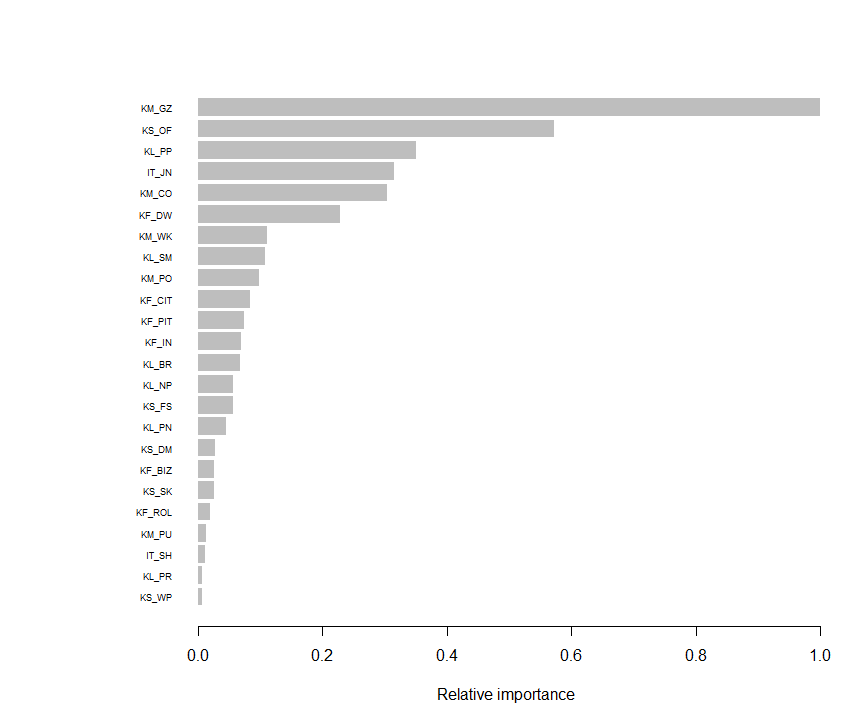
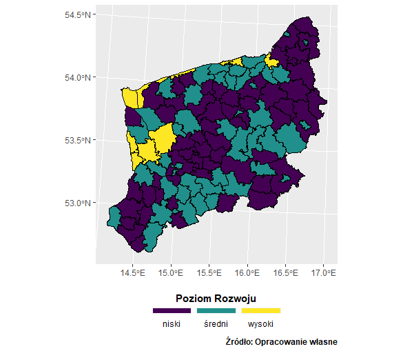
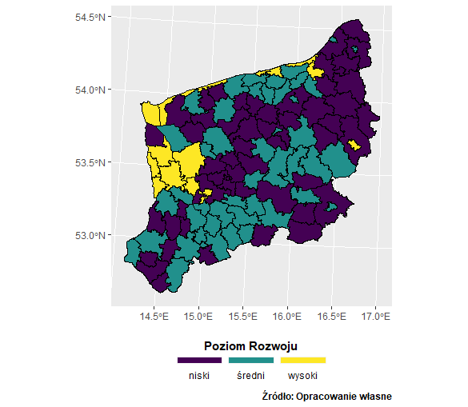
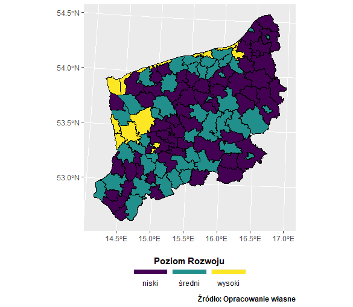
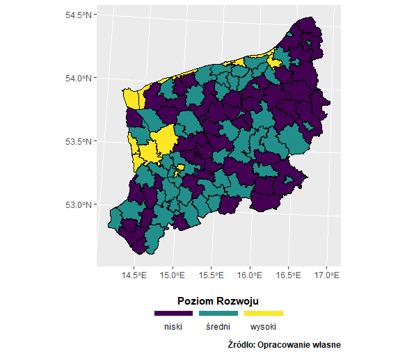

# Analiza Danych {#ad}
## Wyliczenie syntetycznego miernika rozwoju  {#miernik}

Analizę danych rozpoczęto od wczytania wstępnie oczyszczonych danych w formacie *xlsx* za pomocą pakietu *openxlsx* [@R-openxlsx].
Konstrukcje syntetycznego wskaźnika rozwoju rozpoczęto od wykonania funkcji unitaryzacji zerowanej (ang. *min-max normalization*) dla wskaźników będących stymulantami lub destymulantami, za pomocą następujących instrukcji.

```{r echo=TRUE, eval=FALSE}
#stymulanta
minmaxS <- function(x, na.rm = FALSE) {
  return((x- min(x)) /(max(x)-min(x)))
}
#destymulanta
minmaxD <- function(x, na.rm = FALSE) {
  return((max(x)- x) /(max(x)-min(x)))
}
```

Następnym krokiem było zastosowanie przygotowanej funkcji unitaryzacji zerowanej na danych dla odpowiednich wskaźników przy wykorzystaniu funkcji *as.data.frame*, *lapply* z pakietu *base* [@R-base] oraz *select* z pakietu *dplyr* [@R-dplyr].

```{r echo=TRUE, eval=TRUE, tidy=TRUE, tidy.opts=list(width.cutoff=60)}
library(dplyr)
#wybieram i normalizuje stymulanty
gus2016_normS <- as.data.frame(lapply(select(Gus_2016, 4:6,8:12,14:15,17:26), minmaxS))

#wybieram i normalizuje destymulanty
gus2016_normD <- as.data.frame(lapply(select(Gus_2016, 3,7,13,16), minmaxD))

#łącze i dodaje TERYT, nazwa gminy
gus2016_norm <- cbind(gus2016_normS, gus2016_normD) 
```

Następnie za pomocą następujących instrukcji skonstruowano i zastosowano funkcję opartą na mierze niepodobieństwa Braya-Curtisa (patrz Podrozdział \@ref(wskaznik)) wyliczającą syntetyczny wskaźnik poziomu rozwoju oraz jego aspekty (patrz Podrozdział \@ref(dane)).

```{r echo=TRUE, eval=FALSE}
library(dplyr)
wskaznik <- function(x) {
  x_abs <- as.data.frame(lapply(x, function(y) abs(y - max(y))))
  x_sum <- as.data.frame(lapply(x, function(y) y + max(y)))
  return(1 - rowSums(x_abs) / rowSums(x_sum))
}

gus2016_norm <- gus2016_norm %>%
  select(order(colnames(gus2016_norm))) %>%
  mutate(Rozwoj = wskaznik(.),
         K_Ludzki = wskaznik(select(., 9:14)),
         K_Spoleczny = wskaznik(select(., 20:24)),
         K_Materialny = wskaznik(select(., 15:19)),
         K_Finansowy = wskaznik(select(., 3:8)),
         Innowacje = wskaznik(select(., 1:2)))
```

Powstała ramka danych zawierająca wskaźnik syntetycznego poziomu rozwoju społeczno-gospodarczego i jego aspektów dla gmin w województwie Zachodniopomorskim w 2016 roku przedstawiała się następująco (patrz Tablica \@ref(tab:tabela2)).
Analogicznie przeprowadzono unitaryzacje oraz obliczono syntetyczny wskaźnik rozwoju społeczno-gospodarczego oraz jego aspekty dla danych za rok 2017-2019.

```{r tabela2, echo=FALSE, eval=TRUE}

df = head(gus2016_base)
x <- knitr::kable(df, 
             caption = "Ramka danych dla wskaźnika syntetycznego poziomu rozwoju społeczno-gospodarczego i jego aspektów na przykładowych obserwacjach",
             booktabs = TRUE) %>% 
    kable_styling(latex_options="scale_down")

add_footnote(x, c("Zródło: Opracowanie własne"), notation = "symbol")

```

## Analiza skupień  {#as_ad}

Analizę skupień metodą K-średnich rozpoczęto od znalezienia optymalnej liczby skupień. Skorzystano z pakietu *factoextra* (@R-factoextra) i następującymi instrukcjami wykorzystując funkcję *fviz_nbclust*. Wykresy przedstawiające optymalną liczbę skupień wykonano dla każdego rocznika z przedziału 2016-2019 z pomocą pakietu *ggplot2*  (@R-ggplot2) oraz połączono je za pomocą funkcji *grid.arrange* z&nbsp;pakietu *gridExtra* (@R-gridExtra)

```{r echo=TRUE, eval=TRUE, tidy=TRUE, tidy.opts=list(width.cutoff=60)}
#szukanie optymalnej liczby skupień Elbow Method
set.seed(123)
p1 <-factoextra::fviz_nbclust(gus2016_norm, kmeans, method = "wss", k.max = 10)+
  ggplot2::geom_vline(xintercept = 4, linetype = 2)+
  ggplot2::ggtitle("2016") 
p2 <-factoextra::fviz_nbclust(gus2017_norm, kmeans, method = "wss", k.max = 10)+
  ggplot2::geom_vline(xintercept = 4, linetype = 2)+
  ggplot2::ggtitle("2017") 
p3 <-factoextra::fviz_nbclust(gus2018_norm, kmeans, method = "wss", k.max = 10)+
  ggplot2::geom_vline(xintercept = 4, linetype = 2)+
  ggplot2::ggtitle("2018") 
p4 <-factoextra::fviz_nbclust(gus2019_norm, kmeans, method = "wss", k.max = 10)+
  ggplot2::geom_vline(xintercept = 4, linetype = 2)+
  ggplot2::ggtitle("2019") 

gridExtra::grid.arrange(p1,p2,p3,p4)
```
W przypadku metody Łokcia, optymalną liczbę skupień wyznacza miejsce zgięcia (patrz Podrozdział \@ref(skupien)). W tym przypadku dla danych za rok 2016 optymalna liczba skupień ($k$) to 4. Metoda Łokcia dla innych roczników wyznaczała taką samą optymalną liczbę skupień (4).
```{r echo=TRUE, eval=TRUE, tidy=TRUE, tidy.opts=list(width.cutoff=60)}
#szukanie optymalnej liczby skupień Average Silhouette Method
p1 <- factoextra::fviz_nbclust(gus2016_norm, kmeans, method = "silhouette")+
  ggplot2::ggtitle("2016") #idealnie 2, do 5 jest ok
p2 <-factoextra::fviz_nbclust(gus2017_norm, kmeans, method = "silhouette")+
  ggplot2::ggtitle("2017") #idealnie 2, do 5 jest ok
p3 <-factoextra::fviz_nbclust(gus2018_norm, kmeans, method = "silhouette")+
  ggplot2::ggtitle("2018") #idealnie 2, do 5 jest ok
p4 <-factoextra::fviz_nbclust(gus2019_norm, kmeans, method = "silhouette")+
  ggplot2::ggtitle("2019")

gridExtra::grid.arrange(p1,p2,p3,p4)
```
W przypadku metody średniego zarysu (Average Silhouette Method) im większa wartość średniego zarysu dla danej liczby skupień $k$ tym bardziej jest ona optymalna.
Jak widać optymalna liczba skupień we wszystkich latach to 2, jednak warto zauważyć, że średnia wartość zarysu dla 3 skupień jest niewiele mniejsza, zwłaszcza dla lat 2017-2019.

```{r echo=TRUE, eval=TRUE, tidy=TRUE, tidy.opts=list(width.cutoff=60)}
#szukanie optymalnej liczby skupień Gap Statistic Method
p1 <- factoextra::fviz_nbclust(gus2016_base, kmeans, method = "gap_stat")+
  ggplot2::ggtitle("2016") 
p2 <-factoextra::fviz_nbclust(gus2017_norm, kmeans, method = "gap_stat")+
  ggplot2::ggtitle("2017") 
p3 <-factoextra::fviz_nbclust(gus2018_norm, kmeans, method = "gap_stat")+
  ggplot2::ggtitle("2018") 
p4 <-factoextra::fviz_nbclust(gus2019_norm, kmeans, method = "gap_stat")+
  ggplot2::ggtitle("2019")

gridExtra::grid.arrange(p1,p2,p3,p4)
```

Dla statystycznej metody luki (Gap Statistic Method) optymalna liczba skupień $k$ to taka, dla której wartość statystyki luki jest większa niż $k+1$ minus odchylenie standardowe. Co ciekawe dla różnych roczników statystyka ta przyjmuje różne wartości. Dla 2016 roku optymalna liczba skupień to 3, dla 2017, 2019 roku optymalną liczbą skupień to 2, natomiast dla 2018 roku optymalna liczba skupień to 5.

Ostatecznie kierując się powyższymi statystykami, sprawdzając jak rozkładają się obserwacje dla różnej liczby skupień i kierując się wiedzą merytoryczną z zakresu badań nad poziomem rozwoju oraz praktyką badawczą, sugerującą nieparzystą i ograniczoną liczbę skupień zdecydowano się na dalsze badania dla 3 skupień. Natomiast warto zaznaczyć, że liczby skupień 4 lub 5 wydają się też dość optymalne. W badaniach Pana Doktora Perdała (@perdal_zastosowanie) za optymalna liczbę skupień określono 5.

Przydzielanie do skupień metodą K-średnich wykonano za pomocą następujących instrukcji korzystając z funkcji *kmeans* oraz *fviz_cluster* z pakietu *factoExtra* (@R-factoExtra).
W funkcji *fviz_cluster*  obserwacje są reprezentowane przez punkty na wykresie, przy użyciu dwóch pierwszych składowych głównych.
```{r rycina5 , tidy=TRUE, tidy.opts=list(width.cutoff=60), out.width = '105%'}
k1 <- kmeans(gus2016_base$Rozwoj, centers = 3, nstart = 10)  
factoextra::fviz_cluster(k1, data = gus2016_base)+
  ggplot2::ggtitle("2016")
```
Interpretacja skupień dla obserwacji z 2016 roku przedstawia się następująco (dokładane przedstawienie poziomów rozwoju dla poszczególnych obserwacji w Podrozdziale (\@ref(mapy))):

* skupienie o numeracji 1 przedstawia obserwacje o średnim poziomie rozwoju
* skupienie o numeracji 2 przedstawia obserwacje o niskim poziomie rozwoju
* skupienie o numeracji 3 przedstawia obserwacje o wysokim poziomie rozwoju


```{r, tidy=TRUE, tidy.opts=list(width.cutoff=60), out.width = '105%'}
k2 <- kmeans(gus2017_base$Rozwoj, centers = 3, nstart = 10)  
factoextra::fviz_cluster(k2, data = gus2017_base)+
  ggplot2::ggtitle("2017")
```
Interpretacja skupień dla obserwacji z 2017 roku przedstawia się następująco:

* skupienie o numeracji 1 przedstawia obserwacje o średnim poziomie rozwoju
* skupienie o numeracji 2 przedstawia obserwacje o niskim poziomie rozwoju
* skupienie o numeracji 3 przedstawia obserwacje o wysokim poziomie rozwoju
```{r, tidy=TRUE, tidy.opts=list(width.cutoff=60), out.width = '105%'}
k3 <- kmeans(gus2018_base$Rozwoj, centers = 3, nstart = 10)  
factoextra::fviz_cluster(k3, data = gus2018_base)+
  ggplot2::ggtitle("2018")
```
Interpretacja skupień dla obserwacji z 2018 roku przedstawia się następująco:

* skupienie o numeracji 1 przedstawia obserwacje o średnim poziomie rozwoju
* skupienie o numeracji 2 przedstawia obserwacje o wysokim poziomie rozwoju
* skupienie o numeracji 3 przedstawia obserwacje o niskim poziomie rozwoju
```{r, tidy=TRUE, tidy.opts=list(width.cutoff=60), out.width = '105%'}
k4 <- kmeans(gus2019_base$Rozwoj, centers = 3, nstart = 10)  
factoextra::fviz_cluster(k4, data = gus2019_base)+
  ggplot2::ggtitle("2019")
```
Interpretacja skupień dla obserwacji z 2019 roku przedstawia się następująco:

* skupienie o numeracji 1 przedstawia obserwacje o wysokim poziomie rozwoju
* skupienie o numeracji 2 przedstawia obserwacje o niskim poziomie rozwoju
* skupienie o numeracji 3 przedstawia obserwacje o średnim poziomie rozwoju


Jak widać na powyższych wykresach, liczba skupień 3 dla metody K-średnich wygląda zadowalająco. Także, metoda K-średnich dla podziału obserwacji ze względu na syntetyczny wskaźnik poziomu rozwoju wydaje się optymalna.

W celu porównania wyników grupowania skupień za pomocą innej metody niż K-średnich zdecydowano się na wykonanie analizy DBSCAN. Analizę skupień metodą DBSCAN wykonano za pomocą pakietu *dbscan* (@R-dbscan).
Rozpoczęto od oszacowania wartości $\epsilon$ za pomocą funkcji *kNNdistplot*, która polega na obliczeniu i wyrysowaniu K-najbliższych odległości. 
Następnie analityk określa moment zgięcia (kolana), który odpowiada optymalnemu parametrowi $\epsilon$.

```{r, tidy=TRUE, tidy.opts=list(width.cutoff=60)}
dbscan::kNNdistplot(gus2016_base, k =  3)
abline(h = 0.135, lty = 2)
set.seed(12345)
model.dbscan <- fpc::dbscan(gus2016_base, eps = 0.175, MinPts = 2)
factoextra::fviz_cluster(model.dbscan, gus2016_base, geom = 'point') 
```

Jak widać powyżej dla badanych obserwacji metoda DBSCAN nie daje satysfakcjonujących wyników z uwagi na przydzielenie wielu obserwacji do szumu, co w przypadku, gdy obserwacjami są gminy jest niezasadne merytorycznie. Dlatego pewnym rozwinięciem metody DBSCAN jest metoda OPTICS, w której efekty grupowania są podobne jak w&nbsp;DBSCAN, z tą różnicą, że metoda ta nie zostawia obserwacji bez przypisanego skupienia (szumu).


```{r, tidy=TRUE, tidy.opts=list(width.cutoff=60)}
#Model optics, Reachability plot
model.optics <- dbscan::optics(gus2016_base, eps = 0.175, minPts = 2)
plot(model.optics)
```
Doliny na wykresie dostępności informują o istnieniu skupień, a szerokość doliny informuje o licznie obiektów przydzielonych do różnych skupień.

```{r, tidy=TRUE, tidy.opts=list(width.cutoff=60)}
#optics skupienia
(result.optics <- dbscan::extractDBSCAN(model.optics, eps_cl = 0.4))
factoextra::fviz_cluster(list(data = gus2016_base, 
                  cluster = result.optics$cluster), 
             geom = 'point')
```

Niestety metoda ta wydaje się niezadowalająca. Znacząca większość obiektów została przypisana do jednego skupienia. Pozostałe 3 skupienia zawierają niewielką liczbę obserwacji.
Biorąc pod uwagę powyższe wyniki grupowania za pomocą różnych metod analizy skupień, zdecydowano w dalszym badaniu wykorzystać wyniki uzyskane za pomocą metody K-średnich.
Podział na 3 skupienia za pomocą analizy skupień pozwolił na określenie trzech poziomów rozwoju (wysoki, średni, niski).

## Klasyfikacja  {#kla_ad}

Klasyfikacje metodą lasów losowych wykonano w programie R następującymi instrukcjami wykorzystując funkcję *randomForest*,  z pakietu *randomForest* [@R-randomForest], która tworzy model lasów losowych.
```{r load srodowisko_magist2016, include=FALSE}
load("~/MAGISTERKA/R_magist/env_2016+mapa_3.RData")
```

```{r, tidy=TRUE, tidy.opts=list(width.cutoff=60)}
model.forestN <- randomForest::randomForest(formula = Poziom_Rozwoju ~ .,
                             data = gus2016_norm,
                             ntree = 300,
                             importance = TRUE,
                             proximity = TRUE)
plot(model.forestN)
```
Powyższy wykres przedstawia błąd OOB (ang. *out-of-bag*) - kolor czarny, oraz krzywe wskaźnika błędów błędnej klasyfikacji - kolor niebieski, zielony oraz czerwony. Widać, ze powyżej ok. 150 drzew błąd OOB nie zmniejsza się.

Wykres średniej dokładności spadku (ang. *The Mean Decrease Accuracy*) wyraża, jak dużą dokładność traci model przez wykluczenie każdej zmiennej. Im bardziej ucierpi dokładność, tym ważniejsza jest zmienna dla pomyślnej klasyfikacji. Zmienne są prezentowane według malejącego znaczenia. Średni spadek współczynnika Giniego (ang. *The mean decrease in Gini*) jest miarą tego, jak każda zmienna przyczynia się do jednorodności węzłów i liści w powstałym lesie losowym. Im większa wartość średniej dokładności spadku lub średniego spadku wyniku Giniego, tym większe znaczenie zmiennej w modelu.
Wykres średniej dokładności spadku oraz średniego spadku współczynnika Giniego wykonano następującymi instrukcji za pomocą funkcji *varImpPlot*.
```{r, tidy=TRUE, tidy.opts=list(width.cutoff=60), out.width = '105%' }
randomForest::varImpPlot(model.forestN,
           sort = TRUE)
```
Innym narzędziem przedstawiającym istotność czynników stanowiących model lasów losowych jest *plot_multi_way_importance* z pakietu *randomForestExplainer* [@R-randomForestExplainer]
```{r, tidy=TRUE, tidy.opts=list(width.cutoff=60), message = FALSE}
randomForestExplainer::plot_multi_way_importance(model.forestN, no_of_labels = 10)

```
Jak widać wysoki wskaźnik średniej dokładności spadku oraz średnim spadkiem Ginniego charakteryzuje się wskaźnik określający dostępność do gazu (*KM_GZ* - patrz Tabela \@ref(tab:tabela1)), a kolejnym wskaźnikiem jest dostępność do ogrzewania centralnego (*KM_OG*).
Oba wskaźniki, prócz tej samej kategorii aspektu rozwoju (Kapitał Materialny) są charakterystyczne dla obszarów o zwartej zabudowie.
Model więc w sposób pośredni poinformował nas, że wyższy poziom rozwoju będzie występował na terenach o zwartej zabudowie, czyli uogólniając w miastach.
Następnym istotnym i wiele mówiącym wskaźnikiem są podmioty gospodarcze w sekcjach J-N (*IT_JN*), czyli uogólniając podmioty dostarczające wysoko wykwalifikowanych usług (finanse, nauka, informatyka).
Co ciekawe drugi wskaźnik z aspektu Innowacji- udział spółek handlowych z udziałem kapitału zagranicznego charakteryzuje się niską istotnością. 
Co prowadzi do ciekawych wniosków, jednak może być uwarunkowane lokalną charakterystyką województwa Zachodniopomorskiego.
Wbrew intuicji przyrost naturalny (*KL_PR*) ma niewielkie znaczenie, prawdopodobnie z&nbsp;uwagi na jego niewielki rozrzut wśród gmin oraz duże migracje wewnętrzne. 
Sugeruje to, że możliwą poprawę modelu uzyska się włączając do modelu przyrost rzeczywisty zamiast przyrostu naturalnego.

Sprawdzono, także istotność syntetycznego wskaźnika poziomu rozwoju społeczno-gospodarczego oraz jego poszczególnych aspektów syntetycznego.
```{r, echo=FALSE, eval=TRUE, tidy=TRUE, tidy.opts=list(width.cutoff=60)}

model.forest <- randomForest::randomForest(Poziom_Rozwoju ~ .,
                             data = gus2016_base,
                             ntree = 300,
                             importance = TRUE,
                             proximity = TRUE)
```

```{r, tidy=TRUE, tidy.opts=list(width.cutoff=60)}
randomForest::varImpPlot(model.forest,
           sort = TRUE)
```

```{r, tidy=TRUE, tidy.opts=list(width.cutoff=60), message = FALSE}
randomForestExplainer::plot_multi_way_importance(model.forest, no_of_labels = 10)

```

Jak widać najistotniejszymi kategoriami dla modelu jest rozwój społeczno-gospodarczy oraz kapitał materialny.
Istotny jest również kapitał finansowy.
Natomiast Kapitał ludzki, społeczny oraz innowacje cechują się dość niską istotnością.
Na niską istotność innowacji jako aspektu przekłada się niewielka liczba wskaźników innowacji, które brały udział w konstrukcji syntetycznego wskaźnika rozwoju.
Wiemy natomiast, że biorąc pod uwagę wskaźniki, które przekładają się na syntetyczny poziom rozwoju to wskaźnik będący częścią aspektu innowacje miał bardzo duże znaczenie (*IT_JN*).

Za pomocą poniższych instrukcji korzystając z funkcji *partialPlot* z pakietu *randomForest* wygenerowano  wykres częściowej zależności, który daje graficzne przedstawienie wpływu zmiennej na prawdopodobieństwo przydzielenia do danego skupienia.
```{r ,tidy=TRUE, tidy.opts=list(width.cutoff=60), out.width = '90%'}
randomForest::partialPlot(model.forest, gus2016_base, Rozwoj, "niski")
```
Wykres częściowej zależności pokazuje, że gminy o niskim poziomie rozwoju charakteryzują się syntetycznym wskaźnikiem poziomu rozwoju społeczno-gospodarczego na poziomie poniżej $0.6$, przy czym większość poniżej $0.45$.  


```{r ,tidy=TRUE, tidy.opts=list(width.cutoff=60),out.width = '90%'}
randomForest::partialPlot(model.forest, gus2016_base, Rozwoj, "średni")
```
Zgodnie z powyższym wykresem, większość gmin (obserwacji) zaklasyfikowanych jako gminy o średnim poziomie rozwoju to gminy, których syntetyczny wskaźnik rozwoju zawiera się w przedziale $\{0.45,\dots, 0.6\}$

```{r ,tidy=TRUE, tidy.opts=list(width.cutoff=60),out.width = '90%'}
randomForest::partialPlot(model.forest, gus2016_base, Rozwoj, "wysoki")
```
Większość gmin zakwalifikowanych jako wysoko rozwinięte charakteryzuje się syntetycznym wskaźnikiem poziomu rozwoju powyżej $0.6$.

Podobnie przedstawia się wykres pudełkowy ukazujący poziom rozwoju w zależności od syntetycznego wskaźnika poziomu rozwoju społeczno-gospodarczego. Wykres pudełkowy stworzono za pomocą funkcji *ggboxplot* z pakietu *ggpubr* [@R-ggpubr].

```{r}
ggpubr::ggboxplot(gus2016_base, x = "Poziom_Rozwoju", y = "Rozwoj", 
          color = "Poziom_Rozwoju",
          xlab = "Poziom rozwoju", ylab = "Syntetyczny wskaźnik rozwoju")
```

Klasyfikację metodą xgboost wykonano w programie R za pomocą pakietu *xgboost* [@R-xgboost]. Poniższe instrukcje mają na celu stworzenie modelu xgboost.

```{r, echo=TRUE, eval=TRUE, tidy=TRUE, tidy.opts= list(width.cutoff=60),message = FALSE, warning = FALSE, size = 'tiny'}
dtrain <- list(as.matrix(gus2016_norm[, 1:24]), 
               label = as.numeric(gus2016_norm$Poziom_Rozwoju) - 1)

(xgb.fit <- xgboost::xgboost(data = dtrain[[1]],
                    label = dtrain[[2]],
                    eta = 0.1, # niższa wartość przeciwdziała przeuczeniu
                    max_depth = 10, 
                    nround = 100, 
                    subsample = 0.5, 
                    eval_metric = 'mlogloss', 
                    objective = 'multi:softprob', 
                    num_class = 3, 
                    nthread = 4))
```

Wykres istotności zmiennych dla modelu xgboost wykonano za pomocą poniższych instrukcji.
```{r, echo=TRUE, eval=FALSE, tidy=TRUE, tidy.opts= list(width.cutoff=60),out.width = 300}
xgboost::xgb.plot.importance(xgboost::xgb.importance(colnames(gus2016_norm),
                                   model = xgb.fit))
```

```{r rycina5, echo=FALSE,}

```

Zgodnie z powyższym wykresem najistotniejszym czynnikiem jest *KM_GZ*, czyli podobnie jak przy zastosowaniu przy klasyfikacji metodą lasów losowych. 
Kolejnym istotnym czynnikiem jest udział osób fizycznych prowadzących działalność gospodarczą (KS_OF), wskaźnik ten informuje nas o przedsiębiorczości mieszkańców danej gminy.
Istotny jest też udział osób pracujących w ogóle osób w wieku produkcyjnym oraz dochody własne gminy per capita.
Co ciekawe wskaźnik mający w założeniu przedstawiać jakość rządzenia władzy lokalnej, objawiający się w udziałem specjalistów, kierowników w ogóle radnych nie ma istotnego znaczenia na poziom rozwoju.
Niezwykle istotną role zwartej tkanki przestrzennej na poziom rozwoju społeczno-gospodarczego potwierdza, oprócz wskaźników *KM_GZ*, *KM_CO* niska istotność dochodów z podatku rolnego na mieszkańca (*KF_ROL*).

Za pomocą poniższych instrukcji za pomocą funkcji *xgb.plot.multi.trees* można przedstawić zespół drzew decyzyjnych jako zbiorczą jednostkę.

```{r, echo=TRUE, eval=TRUE, tidy=TRUE, tidy.opts= list(width.cutoff=60)}
xgboost::xgb.plot.multi.trees(colnames(gus2016_norm), model = xgb.fit)
```

## Analiza wariancji  {#aw_ad}

 Jednoczynnikową analizę  wariancji (ang. *one-way ANOVA*) wykonujemy w programie R następującymi instrukcjami wykorzystując funkcję *aov* z pakietu *stats* [@R-stats]. Funkcja *summary* służy do podsumowania modelu analizy wariancji.

```{r,echo=TRUE, eval=TRUE, tidy=TRUE, tidy.opts= list(width.cutoff=60)}
#ANOVA
ANOVA <- stats::aov(gus2016_base$Rozwoj~gus2016_base$Poziom_Rozwoju)
summary(ANOVA) 
```
Ponieważ $p$-wartość jest mniejsza niż poziom istotności $0.001$ to mamy podstawy, żeby odrzucić hipotezę zerową. 
Średnie grupowe różnią się znacząco między sobą.
Możemy stwierdzić, że poziom rozwoju ma istotny wpływ na syntetyczny wskaźnik poziomu rozwoju społeczno-gospodarczego oraz jego aspekty (oznaczone jako reszty z&nbsp;modelu - ang. *Residuals*)

W jednoczynnikowej analizie wariancji istotna $p$-wartość wskazuje, że niektóre średnie grupowe są różne, ale nie wiemy, które pary grup są różne.
Możliwe jest przeprowadzenie wielokrotnych porównań parami, aby określić, czy średnia różnica między poszczególnymi parami grupy jest statystycznie istotna. 

W tym celu wykonano test Tukey-a (jeden z testów post hoc) za pomocą funkcji *TukeyHSD* z pakietu *stats*
```{r,echo=TRUE, eval=TRUE, tidy=TRUE, tidy.opts= list(width.cutoff=60)}
#testy post-hoc
TukeyHSD(ANOVA) 
```
Zgodnie z powyższym wszystkie pary istotnie się różnią, ponieważ $p$-wartość dla każdej z pary wynosi $0$. 
Przy czym największa różnica w średnich jest między poziomami wysoki-niski, co świadczy dobrze o podziale. Różnica między wysokim a średnim poziomem jest większa niż między średnim a niskim.
Może to świadczyć o postępującej polaryzacji rozwoju, żeby to sprawdzić przeprowadzono testy ANOVA i post-hoc Tukeya dla innych roczników.
```{r load srodowisko_magist2017, include=FALSE}
load("~/MAGISTERKA/R_magist/env_2017+mapa_2.RData")

```

```{r,echo=TRUE, eval=TRUE, tidy=TRUE, tidy.opts= list(width.cutoff=60)}
#testy post-hoc
ANOVA <- stats::aov(gus2017_base$Rozwoj~gus2017_base$Poziom_Rozwoju)
summary(ANOVA) 
TukeyHSD(ANOVA) 
```
```{r load srodowisko_magist2018, include=FALSE}
load("~/MAGISTERKA/R_magist/env_2018+mapa_2.RData")

```

```{r,echo=TRUE, eval=TRUE, tidy=TRUE, tidy.opts= list(width.cutoff=60)}
#testy post-hoc
ANOVA <- stats::aov(gus2018_base$Rozwoj~gus2018_base$Poziom_Rozwoju)
summary(ANOVA) 
TukeyHSD(ANOVA) 
```
```{r load srodowisko_magist2019, include=FALSE}
load("~/MAGISTERKA/R_magist/env_2019+mapa_2.RData")

```

```{r,echo=TRUE, eval=TRUE, tidy=TRUE, tidy.opts= list(width.cutoff=60)}
#testy post-hoc
ANOVA <- stats::aov(gus2019_base$Rozwoj~gus2019_base$Poziom_Rozwoju)
summary(ANOVA) 
TukeyHSD(ANOVA) 
```
Powyższe testy prowadzą do ciekawych wniosków. 
W 2017 roku znacząco zmniejszyła się polaryzacja poziomu rozwoju w województwie Zachodniopomorskim.
Następnie sukcesywnie co roku wzrastała i w 2019 roku osiągnęła wyższy poziom niż w 2016 roku.
Można również użyć jednoczesnych testów ogólnych hipotez liniowych wielokrotnego porównywania średnich metodą Tukey-a za pomocą pakietu *multcomp* [@R-multcomp]
```{r,echo=TRUE, eval=TRUE, tidy=TRUE, tidy.opts= list(width.cutoff=60)}
summary(multcomp::glht(ANOVA, lincft = mcp(group = "Tukey"))) 
```
Także ten test odrzucił hipotezę zerową, $p$-wartość dla każdego przypadku jest mniejsza niż $0.001$ 

Ponieważ ANOVA zakłada, że dane mają rozkład normalny, a wariancja między grupami jest jednorodna to należy to sprawdzić.
Jednorodność wariancji między grupami sprawdzono dzięki wykresowi reszt w funkcji dopasowań za pomocą następującej instrukcji.

```{r,echo=TRUE, eval=TRUE, tidy=TRUE, tidy.opts= list(width.cutoff=60)}

plot(ANOVA, 1) 
```
Zgodnie z&nbsp;powyższym wykresem nie ma ewidentnych zależności między resztami a&nbsp;średnią z każdej grupy.
Można więc założyć jednorodność wariancji.

Innym sposobem na sprawdzenie jednorodności wariancji jest test Levene, który można wykonać za pomocą funkcji *leveneTest* z pakietu *car* [@R-car].

```{r,echo=TRUE, eval=TRUE, tidy=TRUE, tidy.opts= list(width.cutoff=60)}
car::leveneTest(gus2016_base$Rozwoj~gus2016_base$Poziom_Rozwoju) 
```
$p$-wartość tego testu jest większa niż poziom istotności $0,05$. Oznacza to, że nie ma dowodów sugerujących, że wariancja między grupami jest istotnie różna. Można założyć jednorodność wariancji w różnych grupach.

Normalność rozkładu można sprawdzić za pomocą wykresu normalności reszt (wykres kwantyl-kwantyl zastosowany do reszt), za pomocą poniższej instrukcji.

```{r,echo=TRUE, eval=TRUE, tidy=TRUE, tidy.opts= list(width.cutoff=60)}
plot(ANOVA, 2)
```

Reszty w przybliżeniu przebiegają wzdłuż linii prostej (45$^\circ$ linii odniesienia), co sugeruje, że można założyć normalność danych.

Powyższe założenie można potwierdzić stosując test Shapiro-Wilka na resztach ANOVA za pomocą poniższych instrukcji, wykorzystując funkcje *shapiro.test* z pakietu *stats*. Test ten nie wykazuje żadnych oznak naruszenia normalności.

```{r,echo=TRUE, eval=TRUE, tidy=TRUE, tidy.opts= list(width.cutoff=60)}
#test shapiro-wilka na resztach w celu sprawdzenia normalności
ANOVA_reszty <- residuals(object = ANOVA)
stats::shapiro.test(x = ANOVA_reszty ) 
```
Zgodnie z powyższym $p$-wartość jest większa niż $0.05$ można więc założyć normalność danych.
Potwierdzono, że dane mają rozkład normalny, a wariancja między grupami jest jednorodna.

Wykonano także nieparametryczny test sumy rang Kruskala-Wallisa, który nie wymaga założenia normalności oraz jednorodności wariancji między grupami. 
Test Kruskala-Wallisa wykonano za pomocą funkcji *kruskal.test* z pakietu *stats*:
```{r,echo=TRUE, eval=TRUE, tidy=TRUE, tidy.opts= list(width.cutoff=60)}
#test Kruskala-Wallis
stats::kruskal.test(gus2016_base$Rozwoj~gus2016_base$Poziom_Rozwoju)
```
Zgodnie z powyższym przyjmujemy hipotezę alternatywną informującą nas o tym, że nie wszystkie mediany grupy są równe. Potwierdza to wnioski płynące z testu ANOVA, dlatego też nie wykonano testów post-hoc dla testu sumy rang Kruskala-Wallisa.


## Wyniki dla ostatecznych grup -mapy {#mapy}

W celu przedstawienia syntetycznego wskaźnika poziomu rozwoju społeczno-gospodarczego należało przygotować mapy, ukazujące rozmieszczenie przestrzenne rozwoju.
W tym celu skorzystano z danych (plik w formacie *shapefile* - *shp*) dotyczących granic administracyjnych (gmin) z Głównego Urzędu Geodezji i Kartografii.
Dane te obejmowały całą Polskę, dlatego korzystając z programu QGIS ograniczono je do województwa Zachodniopomorskiego.
Następnie za pomocą biblioteki *sf* wczytano przygotowany plik *shp* do środowiska R za pomocą funkcji *read_sf*:
```{r, echo=TRUE, eval=FALSE}
gminy2 <- sf::read_sf('zachpom_gminy.shp')

```
Następnie przygotowano dane dotyczące poziomu rozwoju oraz jego aspektów tak, żeby połączyć je z mapą. Zrobiono to za pomocą poniższych instrukcji.
```{r, echo=TRUE, eval=FALSE, tidy=TRUE, tidy.opts= list(width.cutoff=60)}

data_map2016 <- select(Gus_2016, 1:2) 
data_map2016$ID <- seq.int(nrow(data_map2016)) #dodaje ID

data_map2016_temp <- dplyr::select(gus2016_base, 1:7) 
data_map2016_temp$ID <- seq.int(nrow(data_map2016_temp))
data_map2016 <- dplyr::right_join(data_map2016,data_map2016_temp, by = "ID")

names(gminy2)[1] <- "TERYT" #zmiana nazwy 

gminy2 <- dplyr::right_join(gminy2,data_map2016 )
gminy2 <- dplyr::select(gminy2, -"ID") #usuwam niepotrzebne kolumny
gminy2 <- ggplot2::fortify(gminy2) #dataframe

```
Mając przygotowane dane wykonano mapę za pomocą poniższych instrukcji dla roku 2016. Analogicznie wykonano mapy dla innych roczników.

```{r, echo=TRUE, eval=TRUE}
library(ggplot2)
mapa_2016 <- ggplot()+
  geom_sf(aes(fill=Poziom_Rozwoju),color='transparent',data=gminy2)+
  geom_sf(fill='transparent',color='white',data=gminy2)+
  scale_fill_viridis_d(name='Poziom Rozwoju',
                       guide=guide_legend(
                         direction='horizontal',
                         title.position='top',
                         title.hjust = .5,
                         label.hjust = .5,
                         label.position = 'bottom',
                         keywidth = 3,
                         keyheight = .5
                       ))+
  labs(caption=c('Źródło: Opracowanie własne'))+
  theme_gray()+
  theme(title=element_text(face='bold'),
        legend.position = 'bottom')
```


```{r rycina6, echo=FALSE, fig.cap="Poziom rozwoju gmin w województwie Zachodniopomorskim (2016)"}

```
W 2016 roku (patrz Rysunek \@ref(fig:rycina6)) wysokim poziomem rozwoju charakteryzował się Szczecin wraz z&nbsp;pobliskim gminami- Dobrą Szczecińską Kołbaskowem i&nbsp;Goleniowem oraz miejscowości nabrzeżne- Świnoujście, Kołobrzeg, Mielno, Ustronie Morskie, Międzyzdroje, Dziwnów, Rewal. Drugim ośrodkiem miejskim nie należącym ani do aglomeracji Szczecińskiej ani nie będący gminą nadmorską, a&nbsp;charakteryzujący się wysokim poziomem rozwoju jest Koszalin.
Koszalin oraz Kołobrzeg są gminami na północy województwa, których wysoki poziom rozwoju „dyfuzyjnie" rozchodzi się na powiat, tworząc razem z&nbsp;Białogardem (większy ośrodek miejski, zakwalifikowany jako gmina o&nbsp;średnim poziomie rozwoju) pas gmin o&nbsp;średnim poziomie rozwoju.
Scharakteryzować można pas gmin o&nbsp;niskim poziomie rozwoju ciągnący się pojezierzem zachodniopomorskim oraz gminy na wschód i&nbsp;południe od Koszalina.

```{r rycina7, echo=FALSE, fig.cap="Poziom rozwoju gmin w województwie Zachodniopomorskim (2017)"}

```
W 2017 roku (patrz Rysunek \@ref(fig:rycina7)) widać przyrost gmin charakteryzujących się wysokim poziomem rozwoju w obrębie aglomeracji szczecińskiej. 
W porównaniu do roku poprzedniego do kategorii tej dołączył Stargard, Police, Kobylanka.
Koszalin oraz miejscowości nadmorskie także zostały przydzielone do wysokiego poziomu rozwoju.
Natomiast ciekawym przypadkiem jest miasto Szczecinek, które w 2017 roku osiągnęło wysoki poziom rozwoju społeczno-gospodarczego, a okola je gmina wiejska o takiej samej nazwie charakteryzująca się niskim poziomem rozwoju.
Gminy w powiecie stargardzkim (Dolice, Suchań) odznaczają się średnim poziomem rozwoju.
Generalizując jest to rok „lepszy" dla gmin w zachodniej części województwa.
```{r rycina8, echo=FALSE, fig.cap="Poziom rozwoju gmin w województwie Zachodniopomorskim (2018)"}

```
W 2018 (patrz Rysunek \@ref(fig:rycina8)) roku Police oraz Kobylanka przydzielone zostały do gmin o średnim poziomie rozwoju. Można powiedzieć, że aglomeracja Szczecińska „osłabła", jednak Stargard pozostał gminą o wysokim poziomie rozwoju. Warto zaznaczyć, że jest to największy ośrodek miejski w aglomeracji Szczecińskiej oprócz Szczecina.
Miasto Szczecinek tak jak w 2016 roku zostało sklasyfikowane jako gmina o&nbsp;średnim poziomie rozwoju.
Dolice, Lipiany i Suchań ponownie „wróciły" do gmin o niskim poziomie rozwoju.
```{r rycina9, echo=FALSE, fig.cap="Poziom rozwoju gmin w województwie Zachodniopomorskim (2019)"}

```
Brak zmian wśród gmin o wysokim poziomie rozwoju w 2019 roku (patrz Rysunek \@ref(fig:rycina9)) w stosunku do roku poprzedniego. Widać pozytywny wpływ Stargardu, który pozostał jako gmina o&nbsp;wysokim poziomie rozwoju i&nbsp;wpłynął na okalającej miasto gminę wiejską o&nbsp;tej samej nazwie. 
Gmina miejsko-wiejska Sianów na wschód od Koszalina zaklasyfikowała się jako gmina o&nbsp;średnim poziomie rozwoju.


```{r pakiertbib, echo=FALSE, warning=FALSE}
pakiety = c("base",
"dplyr",
"kableExtra",
"openxlsx",
'sf',
'rgdal',
'ggthemes',
'tidyverse',
'cluster',
'factoextra',
'dbscan',
'fpc',
'caret',
'ggplot2',
'gridExtra',
'randomForest',
'randomForestExplainer',
'xgboost',
'ggpubr',
"multcomp",
"car"
)

knitr::write_bib(pakiety, "packages.bib", width = 60)
```

